# Procesverslag
**Auteur:** Eliza Frida van Binnendijk

Markdown cheat cheet: [Hulp bij het schrijven van Markdown](https://github.com/adam-p/markdown-here/wiki/Markdown-Cheatsheet). Nb. de standaardstructuur en de spartaanse opmaak zijn helemaal prima. Het gaat om de inhoud van je procesverslag. Besteedt de tijd voor pracht en praal aan je website.

## Bronnenlijst
1. -bron 1-
2. -bron 2-
3. -...-

## Eindgesprek (week 7/8)

-dit ging goed & dit was lastig-

**Screenshot(s):**

-screenshot(s) van je eindresultaat-

## Voortgang 3 (week 6)

### Stand van zaken

Deze week ging ik aan de slag met het toevoegen van kleine dingen, het maken van een hamburger menu en het schrijven van javascript. De twee pagina's zijn nu volledig af voor mobiel. Ik ben begonnen met het kijken naar de responsive heid van mijn applicatie en ik wil dit volgende week af maken, door het toevoegen van mediaqueries. Medestudenten hebben mij geholpen met de problemen die ik tegenkwam tijdens het uitklappen van het hamburger menu, dit was erg fijn.

**Screenshot(s):**

### Agenda voor meeting

### Verslag van meeting

Dit zijn de dingen waar ik een vraag over heb:
- Hoe kan je ervoor zorgen dat de + van een hamburger veranderd in een - wanneer die is geopend?

## Voortgang 2 (week 5)

### Stand van zaken

In week 4 kwam ik niet echt toe aan mijn website, wel aan de oefeningen. In week 5 heb ik een flinke inhaalslag gemaakt en enorm veel kunnen doen. De twee pagina's zien er nu goed uit op mobiel. Er zijn nog wat kleine dingen die ik wil toevoegen, zoals een hamburger menu en ik wil een poging doen tot het responsive maken van de website de komende weken.

**Screenshot(s):**

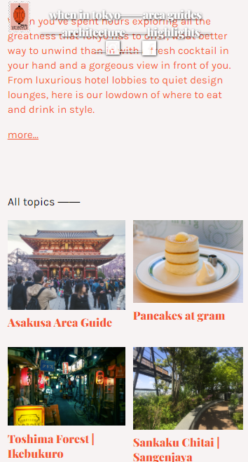
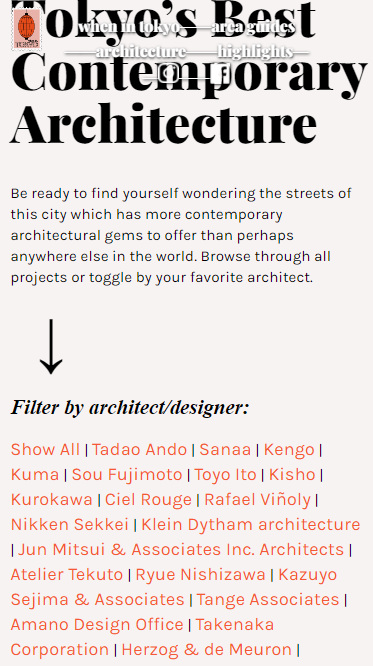
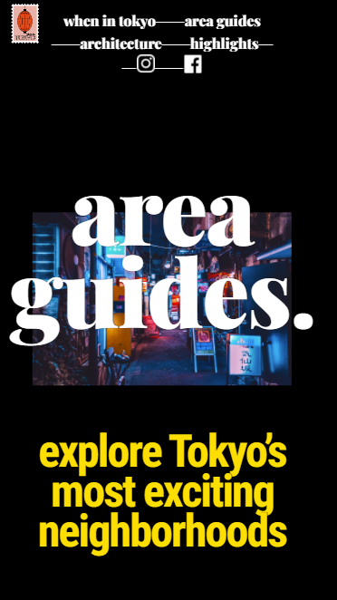

### Agenda voor meeting

Donderdag 1 oktober

### Verslag van meeting

Dit zijn de dingen waar we vragen over hebben:
- Carrousel (css/html of js, beste optie?)
- Css image slider animation (Eliza)
- Text responsive maken- fluid typografie of @mediaQueries?
:hover bug (Jelle)
- slider van tekst en dingen toevoegen in winkelmandje (Ysabella)

## Voortgang 1 (week 3)

### Stand van zaken

Het schrijven van de HTML ging best goed, maar toen ik begon met het positioneren van elementen in CSS ben ik het wel erg lastig gaan vinden. Ik vroeg mij af wanneer ik bijvoorbeeld flexbox moest gebruiken en wanneer absoluut positioneren etc. Met de hulp van klasgenoten en goed googlen heb ik uiteindelijk een goed begin kunnen maken aan mijn website. 

**Screenshot(s):**

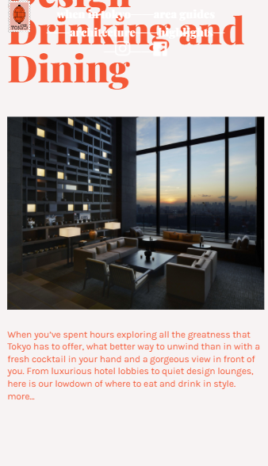

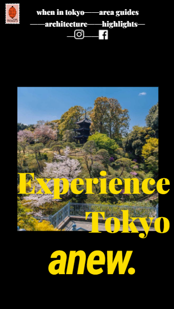

### Agenda voor meeting

Woensdag 16 september: van 11:00-16:00 op teams aan het project gewerkt

### Verslag van meeting

Met de hulp van mijn klasgenoten heb ik een aantal dingen centraal kunnen positioneren. Met bijvoorbeeld 'transform: translate(-50%, -50%);'

## Intake (week 1)

**Je startniveau:** blauw

**Je focus:** responsive

**Je opdracht:** (https://whenin.tokyo/)

**Screenshot(s):**

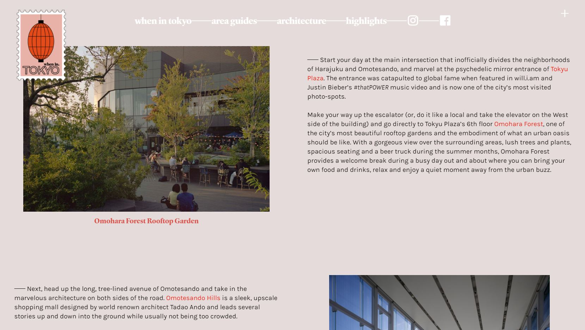

**Eerste Breakdown-schetsen:**

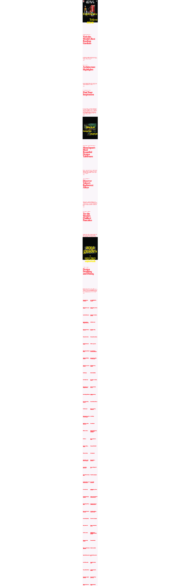
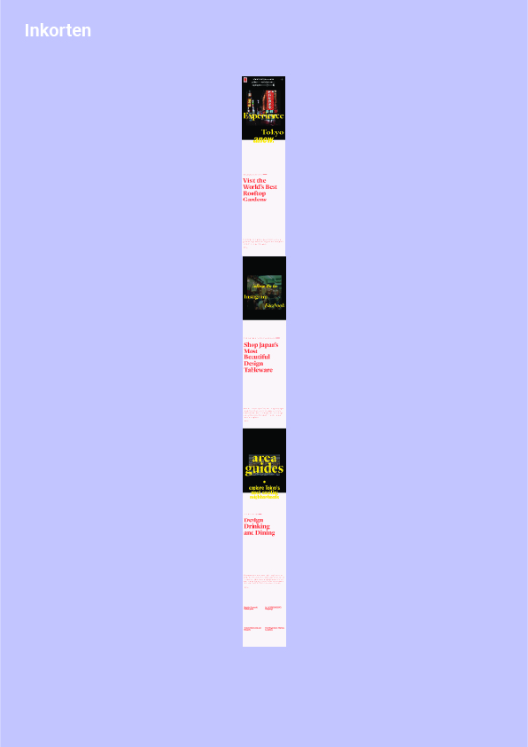
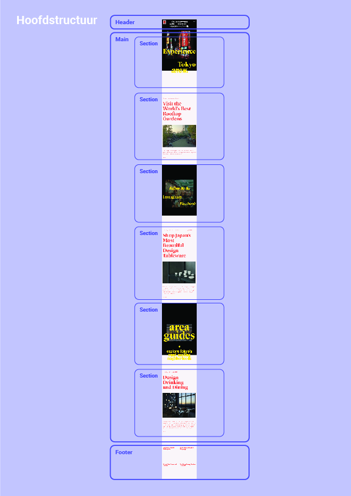

**Verbeterde Breakdown-schetsen:**

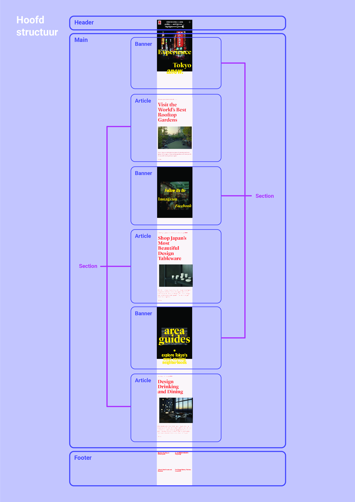
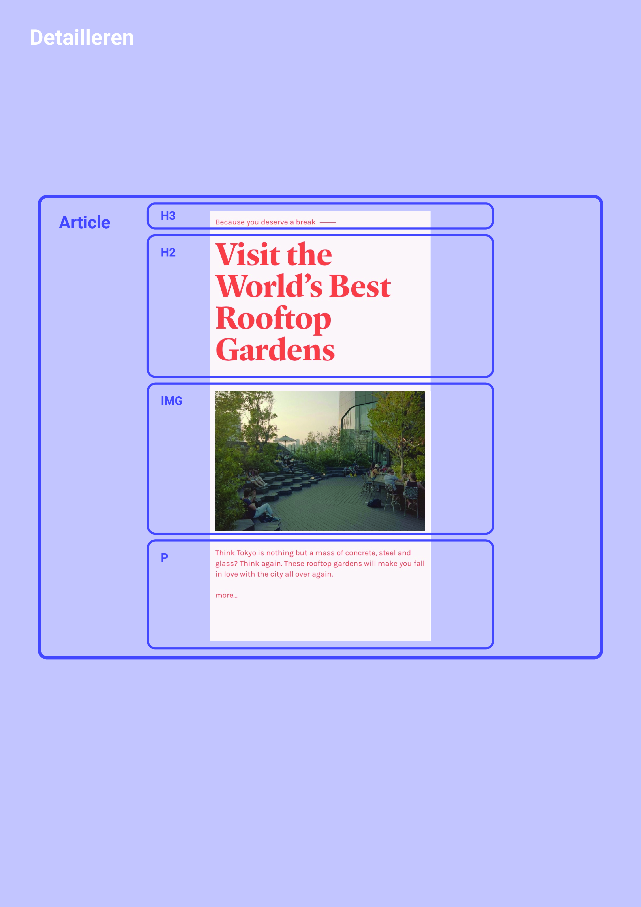

**Opnieuw verbeterde Breakdown-schetsen:**

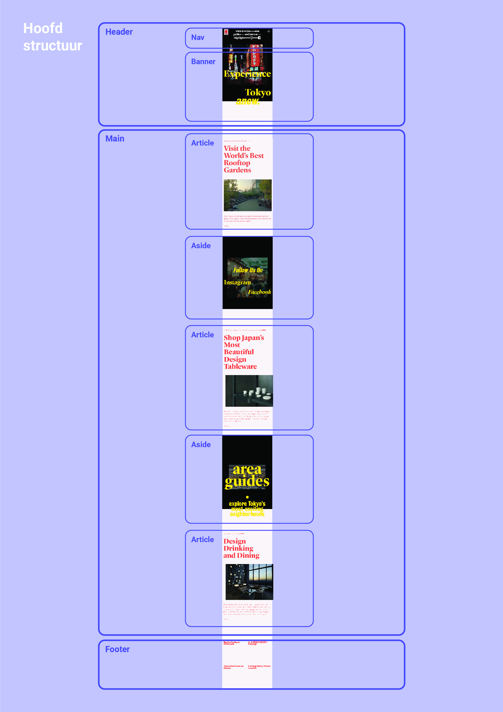
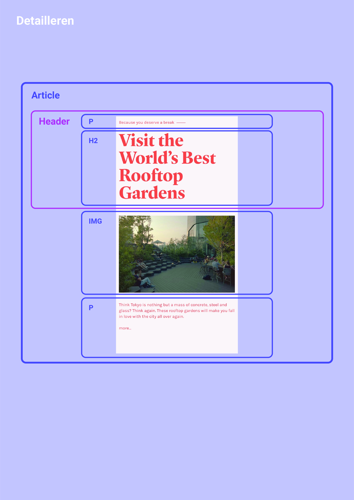
