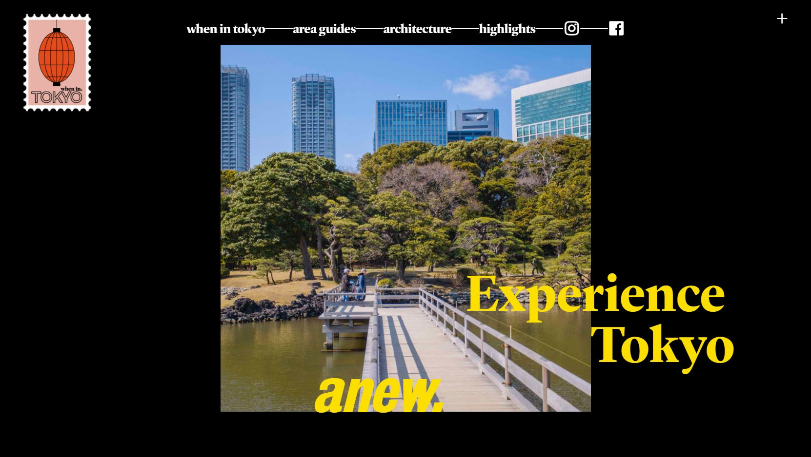

# Procesverslag
**Auteur:** Eliza Frida van Binnendijk

Markdown cheat cheet: [Hulp bij het schrijven van Markdown](https://github.com/adam-p/markdown-here/wiki/Markdown-Cheatsheet). Nb. de standaardstructuur en de spartaanse opmaak zijn helemaal prima. Het gaat om de inhoud van je procesverslag. Besteedt de tijd voor pracht en praal aan je website.

## Bronnenlijst
1. -bron 1-
2. -bron 2-
3. -...-

## Eindgesprek (week 7/8)

-dit ging goed & dit was lastig-

**Screenshot(s):**

-screenshot(s) van je eindresultaat-

## Voortgang 3 (week 6)

-same as voortgang 1-

## Voortgang 2 (week 5)

-same as voortgang 1-

## Voortgang 1 (week 3)

### Stand van zaken

Het schrijven van de HTML ging best goed, maar toen ik begon met het positioneren van elementen in CSS ben ik het wel erg lastig gaan vinden. Ik vroeg mij af wanneer ik bijvoorbeeld flexbox moest gebruiken en wanneer absoluut positioneren etc. Met de hulp van klasgenoten en goed googlen heb ik uiteindelijk een goed begin kunnen maken aan mijn website. 

**Screenshot(s):**

### Agenda voor meeting

Woensdag 16 september: van 11:00-16:00 op teams aan het project gewerkt

### Verslag van meeting

Met de hulp van mijn klasgenoten heb ik een aantal dingen centraal kunnen positioneren. Met bijvoorbeeld 'transform: translate(-50%, -50%);'

## Intake (week 1)

**Je startniveau:** blauw

**Je focus:** responsive

**Je opdracht:** (https://whenin.tokyo/)

**Screenshot(s):**

**Eerste Breakdown-schetsen:**

**Verbeterde Breakdown-schetsen:**

**Opnieuw verbeterde Breakdown-schetsen:**

